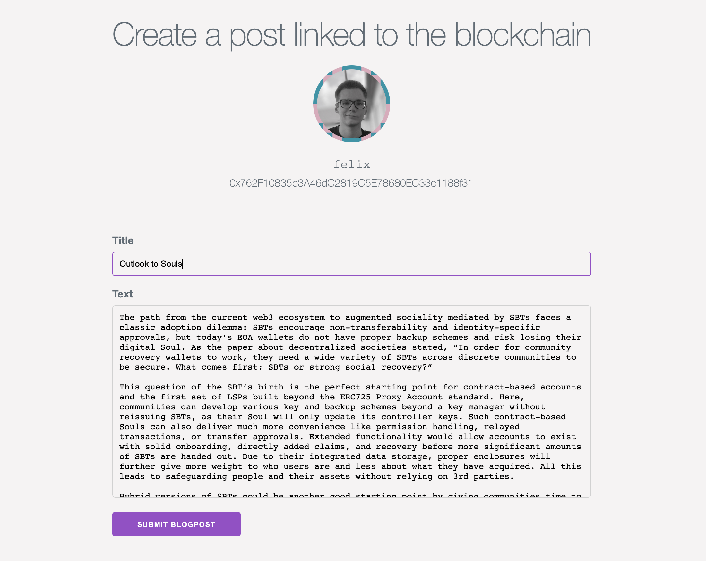

# Example Forum dApp

This repository is an example forum dApp built to showcase how [Universal Profiles](https://docs.lukso.tech/standards/universal-profile/introduction) could function within fully decentralized applications. Users can log in with their extension to create [LSP7](https://docs.lukso.tech/standards/nft-2.0/LSP7-Digital-Asset) blog posts uploaded directly to IPFS and linked to a custom smart contract that inherits a Digital Asset Token.

Each blog post comes with a creation date and likes and can be the origin of multiple comments. All blog posts and comments can also be deleted by their owners. All the author information is fetched from Universal Profiles and the custom smart contract directly.

**Admin Functionality**: With the admin functionality, the owner of the forum contract has the right to delete posts and comments to maintain a healthy forum.

## Learnings

- How to extend LSPs with functionality
- Integration of UPs into social media use cases
- Sample dApp with the Next.JS (React) tech stack
- Equal EOA workflow in terms of smart contract interaction

## Live Demo

Deployed to the LUKSO example dApp section at [examples.lukso.tech](https://examples.lukso.tech/).

## Showcase




## Deployment and Hosting

All example dApps on LUKSO are deployed using a custom CI/CD script to host several repositories to one domain with several subfolders. Please deploy merged changes with the GitHub Workflow in the [example-hosting](https://github.com/lukso-network/example-hosting) repository.

## Local Development

### Install

```bash
npm install
```

### Run

```bash
npm run dev
```

Open [http://localhost:3000](http://localhost:3000) with your browser to see the result.

## Production Build

This app is deployed as a static NextJS website.

```bash
npm run export
```
